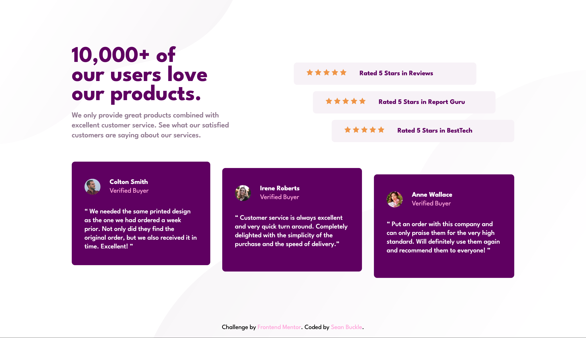

# Frontend Mentor - Social proof section solution

This is a solution to the [Social proof section challenge on Frontend Mentor](https://www.frontendmentor.io/challenges/social-proof-section-6e0qTv_bA). Frontend Mentor challenges help you improve your coding skills by building realistic projects. 

## Table of contents

- [Overview](#overview)
  - [The challenge](#the-challenge)
  - [Screenshot](#screenshot)
  - [Links](#links)
- [My process](#my-process)
  - [Built with](#built-with)
- [Author](#author)

## Overview

### The challenge

Users should be able to:

- View the optimal layout for the section depending on their device's screen size

### Screenshot

### Links

- Solution URL: [https://github.com/seanbuckle/social-proof-section](https://github.com/seanbuckle/social-proof-section)
- Live Site URL: [https://seanbuckle.github.io/social-proof-section/](https://seanbuckle.github.io/social-proof-section/)

## My process

### Built with

- [Semantic HTML5 markup](https://developer.mozilla.org/en-US/docs/Web/HTML)
- [CSS custom properties](https://developer.mozilla.org/en-US/docs/Web/CSS/Using_CSS_custom_properties)
- [Flexbox](https://developer.mozilla.org/en-US/docs/Web/CSS/flex)
- [CSS Grid](https://developer.mozilla.org/en-US/docs/Web/CSS/CSS_Grid_Layout)
- [Mobile-first workflow](https://www.google.com/search?q=mobile+first+workflow&rlz=1C1GCEU_enUS832US832&oq=mobile+first+workflow&aqs=chrome..69i57j0i22i30l9.2953j0j7&sourceid=chrome&ie=UTF-8)
- [Google Fonts](https://fonts.google.com/)
- [SASS/SCSS](https://sass-lang.com/)
- [BEM](http://getbem.com/introduction/)

## Author
- Frontend Mentor - [@seanbuckle](https://www.frontendmentor.io/profile/seanbuckle)
- Twitter - [@seanlbuckle](https://www.twitter.com/seanlbuckle)
- LinkedIn - [@seanbuckle](https://www.linkedin.com/in/seanbuckle/)
